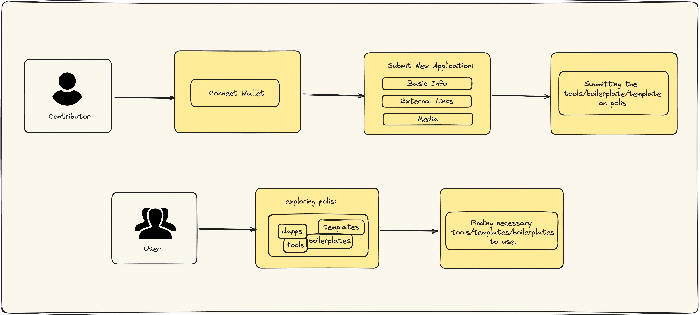

# Polis

---

Polis is a platform dedicated to showcasing web3 tools, templates, and boilerplates. Frequently, these resources remain isolated or challenging to find within the web3 landscape. Polis is committed to addressing this challenge by offering a solution to enhance their discoverability and accessibility.

---

## How It Works



**If you are a Contributor:**

- You can submit new tools/boilerplates/templates
- You will also be able to edit the application later

Note: Contributors will need to connect their wallet to be able to submit and edit the applications.

**If you are a User:**

- You can explore tools, templates and boilerplates on Polis
- You will find all necessary web3 tools/templates/boilerplates in one place

**What are the main features?**

- Connect Wallet
- Submit New Applications: _Can contribute and share your own application on the platform_
- Edit Applications: _Contributors are able to edit the applications they've submitted_
- Editor's Pick: _Users can discover the applications most used by the community_

## Technical Details:

| Name   | Link                            | Text           |
| ------ | ------------------------------- | -------------- |
| Nodejs | https://nodejs.org/en/download/ | Latest Version |
| Infura | https://infura.io/              |                |

### **Libraries used**

Here's an overview of the included frameworks and tools.

- **Next.js** - A frameworks fo React applications that is focused on server-rendered and minimalistic approach.
  We have used latest `app` router and [server actions](https://nextjs.org/docs/app/building-your-application/data-fetching/server-actions).
- **Typescript** - Superset of JavaScript which primarily provides optional static typing, classes and interfaces.
- **Tailwind CSS**- UI & Styling Library.
- [**Wagmi** ](https://wagmi.sh/)- wagmi is a React Hooks library for Ethereum.
- **[Infura IPFS](https://docs.infura.io/networks/ipfs)**- ipfs is a distributed, peer-to-peer (p2p) storage network used for storing and accessing files, websites, applications, and data. IPFS was inegrated with Infura.
- [**w3name**](https://web3.storage/docs/how-tos/w3name/) - w3name is aservice on the top of [web3 storage](https://web3.storage/), that provides secure, stable identifiers for data that changes over time. It uses the [IPNS](https://docs.ipfs.tech/concepts/ipns/) protocol to seamlessly interoperate with the public IPFS network.

---

## Run It Locally

1. Clone the repository

```
git@github.com:Consensys/polis.git
```

2. Install Dependancies

```
cd polis
npm install
```

3. You will need to create a new `.env` file following`.env.example` file. Your `.env` file should look like this:

```
INFURA_API_KEY=
WEB3_NAME_SERVICE_URL=https://name.web3.storage/name
INFURA_IPFS_ENDPOINT=
INFURA_IPFS_GATEWAY=
INFURA_IPFS_KEY=
INFURA_IPFS_SECRET=


DB_HASH=
DB_KEY=
```

Note: To understand how we got `WEB3_NAME_SERVICE_URL=https://name.web3.storage/name` you can check [this](https://web3.storage/docs/reference/w3name-http-api/) out.

You need to:

- Grab your Infura API key and add it to the `.env` file
- You will need to head over to infura ipfs to get the rest.


- To run the dapp locally, you will need your own database. When you will run, `npm run init-db` . It will give you `DB_HASH` and `DB_KEY`.

4. Run the development server.

```
npm run dev
```

Open http://localhost:3000 with your browser to see the result.

---

## Architecture

### Components

IPFS Storage: Our app uses IPFS for storing a simple JSON database. This database is saved in IPFS, which ensures data integrity and redundancy across the network.

#### Database Manipulation:

To enhance data manipulation capabilities, we convert the JSON database into a JavaScript Map object. This conversion allows us to perform various database operations efficiently, such as adding new applications or updating existing ones.

#### IPNS for Data Updates:

As the database evolves due to changes, a new version of the file is created. To keep track of changes and ensure accessibility to the latest version, we employ IPNS (InterPlanetary Name System). The latest file is published into an IPNS name, allowing us to resolve it and retrieve the most recent version of the database.

### Workflow

**Database Initialization** : If you're deploying your own version of the app, follow these steps for database initialization:

- Run `npm run init-db` in the command line interface (CLI).

- The CLI will prompt you for your Infura API key and secret, as we utilize Infura IPFS for the app.

- After successful initialization, the CLI will provide you with two values: DB_HASH and DB_KEY.

**Data Conversion**: After retrieval, the JSON database is converted into a JavaScript Map object. This conversion simplifies and accelerates subsequent database operations.

**Data Manipulation**: Users can interact with the app by adding new applications or updating existing ones. These changes are made to the JavaScript Map representation of the database.

**Database Update**: When changes occur, a new version of the JSON database file is generated. This ensures a historical record of changes made to the database.

**IPNS Publication**: To provide easy access to the latest version of the database, the most recent JSON file is published into an IPNS name. This IPNS name acts as a pointer to the latest version of the database.

**User Access**: Users of the app can resolve the IPNS name to retrieve the most up-to-date version of the database. This allows them to access and manipulate the latest application data.

---
